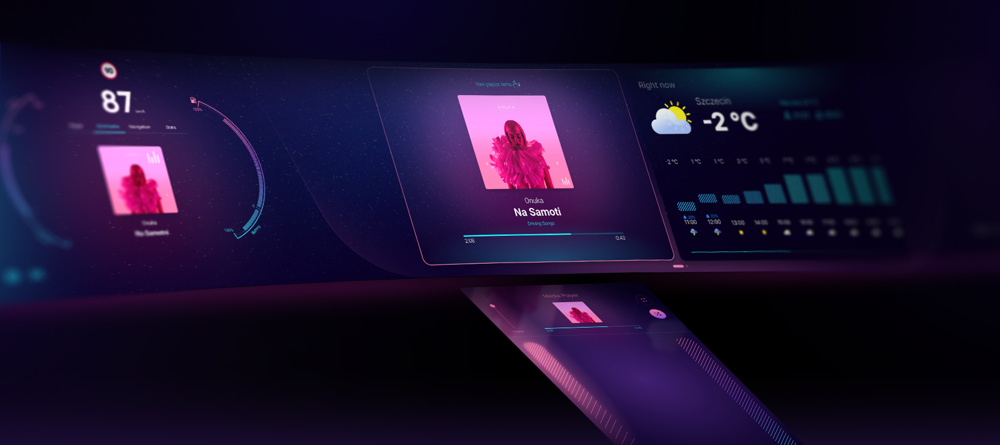
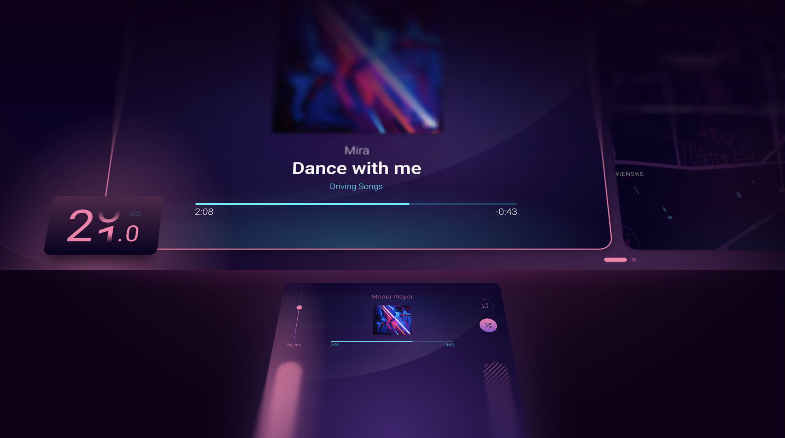
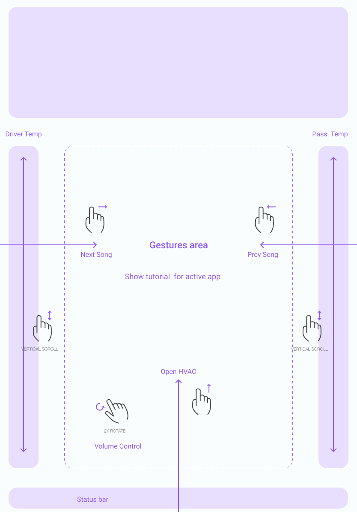
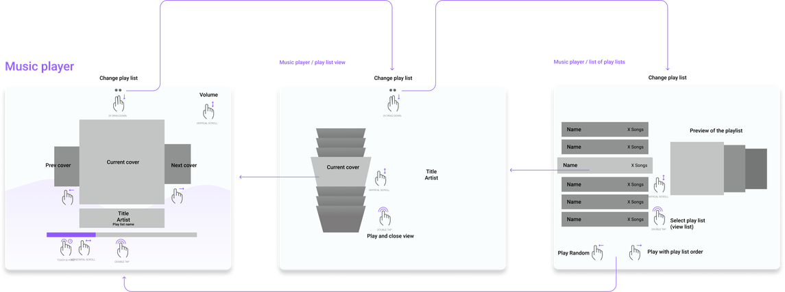

# Wavey Micro HMI Automotive Cockpit



**Wavey** is a fully functional, open-source In-Vehicle Infotainment (IVI) system developed by **Spyrosoft**. Born from our internal R&D initiative, Wavey is designed to demonstrate a modern, production-ready automotive architecture.

**Key Features:**

- **[MicroHMI Architecture](https://spyro-soft.com/blog/hmi/automotive-hmi-architecture):** A modular approach breaking the traditional monolith into isolated, independent interfaces for faster development and easier maintenance.
- **[Multimodal Interaction](https://spyro-soft.com/blog/hmi/multimodal-hmi-solutions):** Features advanced touch interactions alongside a dedicated gesture control module.


- **Custom UX:** A unique interface design that moves away from generic stock Android aesthetics while retaining full functionality.

**Tech Stack:**

- **Hardware:** Qualcomm SA8155P (7nm Automotive SoC).
- **OS:** Android Automotive 11 & QNX Hypervisor.
- **Frameworks:** Qt Interface Framework, Qt Application Manager, Qt for Android Automotive.

This project is a contribution to the open-source automotive community, offering a transparent look at how Spyrosoft engineers high-performance HMI solutions.

[Spyrosoft HMI Services](https://spyro-soft.com/services/hmi-development)

## Gesture Control

The system uses two screens: a **main screen** (widescreen display showing 1–3 applications simultaneously) and a **control screen** (9–11 inch touchscreen placed at an angle between the driver and passenger seats). The main screen does not support touch. Only one application can be active at a time. All gesture input is performed on the control screen.


### Control Screen Layout



| Zone | Description |
|---|---|
| **Top** | Touch-operated controls of the active application. Changing the active application changes the contents of this area. |
| **Middle** | Touch-sensitive space where gestures are performed |
| **Left / Right bars** | Temperature adjustment for left and right sides of the car |
| **Bottom edge** | Swipe up to launch the climate control panel |
| **Status bar** | Application status |

An application can temporarily use the entire control screen (e.g. navigation for setting a destination). All gestures are highlighted by animation.

### Gesture Reference

| Gesture | Action |
|---|---|
| Swipe Left / Right | Operate the active application (action depends on the app, e.g. next/previous song in Media Player) |
| Swipe Up / Down | Operate the active application (action depends on the app, e.g. volume in Media Player) |
| Swipe Left / Right (2 fingers) | Change the active application |
| Swipe Up (3 fingers) | Activate editing mode |
| Swipe Down (3 fingers) | Exit editing mode |
| Long Press | In normal mode: change the active application. In edit mode: open the list of available applications to replace the active one. |
| Pinch In / Out | Change zoom on the map |

General rules:
- One-finger gestures are used to operate the active application
- Two-finger gestures are used to switch between applications and reorder applications
- Three-finger gestures are used to enable/disable editing mode and close applications

### Operating Modes

- **Normal mode** (default): One application is active at a time. Gestures only operate it. Swipe left / right with two fingers to change the active application.
- **Edit mode** (activated by three-finger swipe up): Apps shrink by 50%. Control of their content does not work. In this mode you can:
  - Close the active application (three-finger swipe up)
  - Replace it with another: Long Press to display the list of available applications, scroll with a single finger, finish with Long Press. You can also switch to a different app slot and change the application there. If an application was not running in that slot, you can launch it there.
  - Change the location of an application: two-finger swipe up starts moving it, then swipe left / right to select the new location.
  - Resize the window with a pinch gesture. The change is incremental, up to 4 predefined sizes.
  - A maximum of 3 applications can run simultaneously.

### Temperature Controls

The left and right side bars control temperature on the left and right sides of the car:

- Swipe up — increase temperature
- Swipe down — decrease temperature
- Short movement — change of half a degree
- Long movement — change of a whole degree
- Two-finger swipe — change for both zones simultaneously

### Media Player — Gesture Walkthrough

Each application should be designed so that basic gestures are sufficient to operate it. Any complex action should be moved to the Control Screen, where touch interaction can be used. The Media Player is an example of this approach.

The Media Player allows you to play music tracks that are grouped into lists. The main screen displays the cover of the song being played, along with the previous and next song, song info, and time remaining. There are no controls on the main screen.



**Gestures on the control screen:**

| Gesture | Action |
|---|---|
| Swipe Up / Down | Change volume |
| Swipe Right | Next song |
| Swipe Left | Previous song |
| Double Tap | Stop / Play |
| Long Press + Swipe | Rewind the song |
| Swipe Down (2 fingers) | Navigate down to the track list, then to the list of lists (list of playlists) |

In both lists, you can scroll up / down. A double tap activates playback of the selected list / song. Two more actions are available in both lists: Swipe Left — Play list random, Swipe Right — Play list in order.

Two switches on the control screen allow looping the list and playing it randomly.


---

## Desktop Simulation

This open-source release includes a **desktop simulation environment** using Docker, allowing you to build and run Wavey on a standard PC without specialized automotive hardware.

### Prerequisites

- Docker
- X11 display server (Linux)

### Quick Start

#### 1. Build the Docker Image

Build the development Docker image with Qt 6.4.2 (no Qt account required):

```bash
docker build -t wavey/systemui:oss-qt-6.4.2 -f docker/Dockerfile .
```

This will take approximately 30 minutes on the first build. The image includes:
- Qt 6.4.2 (gcc_64) installed via aqtinstall
- Qt modules: qtapplicationmanager, qtinterfaceframework, qtlocation
- Build tools: CMake 3.24.2, Ninja

#### 2. Build the Project

```bash
./scripts/build.sh
```

Options:
- `--clean` - Remove build directory before building
- `--testbed` - Build with testbed enabled
- `--install` - Install after build
- `--run` - Run from build tree after build
- `--run-installed` - Run from install prefix after build

#### 3. Run the Application

Run from install directory:

```bash
./scripts/run-installed.sh
```

Or run from build directory:

```bash
./scripts/run.sh
```

Options:
- `--main-only` - Run only the main screen
- `--gesture-only` - Run only the gesture screen

## Troubleshooting

### "Could not find the Qt platform plugin xcb"

Ensure `xhost` is installed on your system. The run scripts call it automatically, but if it's missing, install it via your package manager (e.g., `sudo apt install x11-xserver-utils`).

### Build fails with Qt not found

Ensure the Docker image was built successfully:

```bash
docker images | grep wavey/systemui
```

If missing, rebuild the Docker image.

### Display issues in Docker

Ensure these environment variables are passed to Docker:
- `DISPLAY` - Your X11 display
- `/tmp/.X11-unix` - X11 socket mount
- `/dev/dri` - GPU device access

